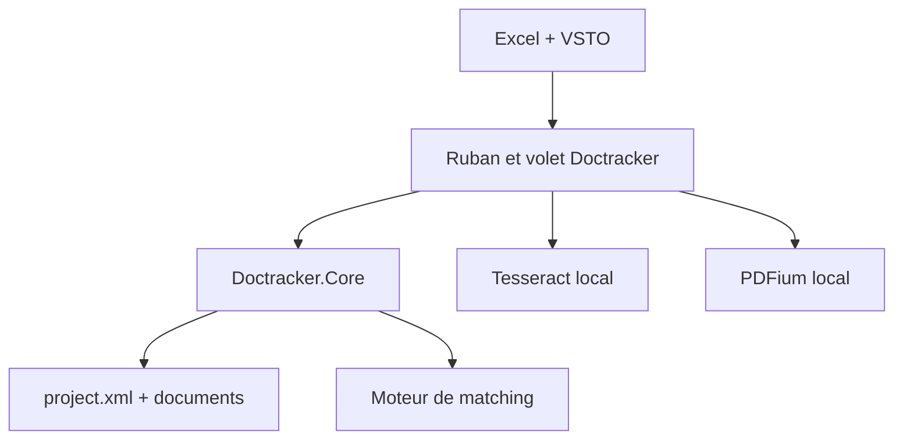

# Architecture Doctracker V0.1.8

## Décision d'architecture

Doctracker sépare la logique d'audit de l'intégration Excel :

Cette séparation permet de tester la persistance, le parsing comptable et le
matching sans lancer Excel. Les interactions COM, le ruban et le volet restent
dans `Doctracker.AddIn`.

## Cycle d'une preuve

1. Le préparateur importe une pièce.
2. Doctracker la copie dans le dossier local de la mission et calcule son
   empreinte SHA-256.
3. Le préparateur dessine une zone sur une page.
4. Le bitmap de cette zone passe dans l'OCR local.
5. Le parseur transforme le texte selon le type de snip.
6. La valeur est écrite dans Excel.
7. Le snip est enregistré avec le document, la page, la zone normalisée, la
   feuille, la cellule, l'auteur et l'heure.
8. Un double-clic sur la cellule recharge la page et surligne la zone.
9. Le relecteur change le statut et saisit son commentaire.

## Modèle de données

`ProjectState` contient :

- `Documents` : nom d'origine, chemin relatif, empreinte, pages OCR ;
- `Snips` : type, texte brut, valeur, rectangle, cellule et statut ;
- `AuditTrail` : action, acteur, date, entité et détail.

Le rectangle est stocké entre `0` et `1`, indépendamment de la résolution
d'affichage. Une zone reste donc stable si la page est rendue à une autre
taille.

## Confidentialité

- pas de base cloud ;
- pas d'API OCR ;
- pas de télémétrie ;
- pas de clé privée ou de jeton dans le dépôt ;
- données OCR stockées dans le dossier de la mission ;
- empreinte des pièces pour détecter les imports en double.

La future vérification de licence devra être isolée du contenu de mission :
seules les informations d'activation pourront transiter, jamais les documents,
les cellules ou les résultats OCR.

## Évolutions prévues

1. index OCR positionnel mot par mot ;
2. Table Snip fondé sur les coordonnées des mots et non les espaces ;
3. matching multicritère paramétrable par colonne ;
4. export du journal de revue ;
5. gestion des versions de pièces ;
6. signature de code et licence commerciale ;
7. installation MSI administrable en environnement cabinet.
